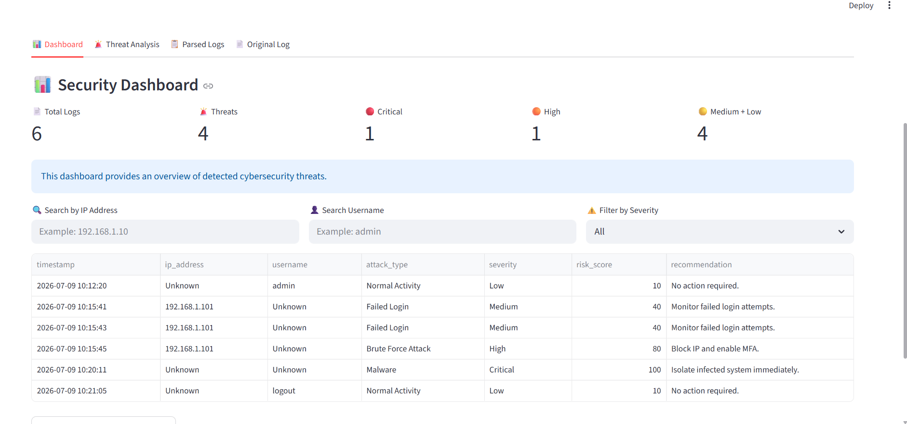
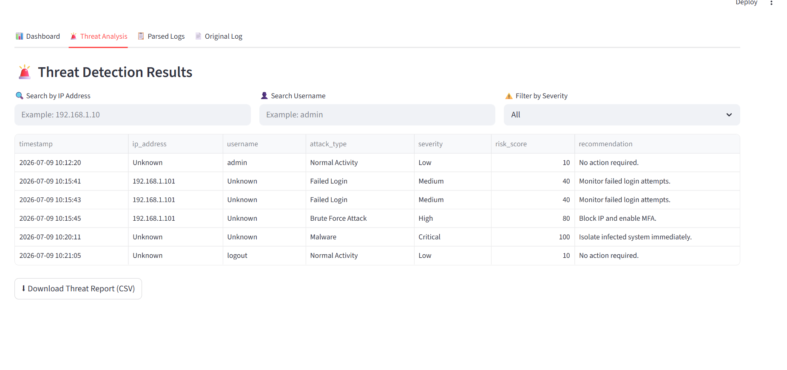
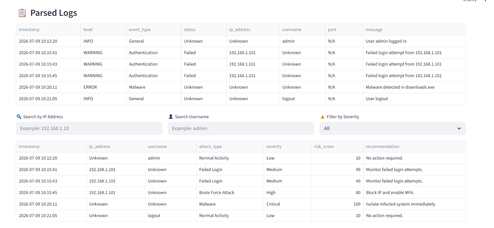

🛡️ AI Cybersecurity Log Analyzer


📌 Project Overview

AI Cybersecurity Log Analyzer is a Streamlit-based web application that analyzes cybersecurity log files and identifies potential security threats.

The application parses raw log files, detects suspicious activities such as brute force attacks, malware, SQL injection, and unauthorized access, and displays the results in an interactive dashboard.

This project demonstrates practical applications of Python in Cybersecurity, Log Analysis, and Data Visualization.

🚀 Features

*  Upload log files (.txt, .log, .csv)

*  Automatic Log Parsing

*  Threat Detection Engine

*  Security Dashboard

*  Threat Severity Classification

Critical
High
Medium
Low

✅ Search Threats by IP Address

✅ Filter Threats by Severity

✅ Download Threat Report (CSV)

✅ View Original Log File

📂 Project Structure
AI_Cybersecurity_Log_Analyzer/

│── App.py
│── parser.py
│── detector.py
│── sample.txt
│── requirements.txt
│── README.md

🛠 Tech Stack
Category	Technology
Language	Python
Framework	Streamlit
Data Processing	Pandas
Parsing	Regex

Threat Detection Rule-Based Python Logic
🚨 Threats Detected

The application currently detects:

Failed Login Attempts
Brute Force Attack
SQL Injection
Malware Detection
Unauthorized Access
Normal Activity

📊 Dashboard Includes
Total Logs
Total Threats
Critical Threats
High Severity Threats
Medium & Low Threats

📥 Installation


 1️⃣ Clone the Repository

```bash
git clone https://github.com/prabhatfulzelethings173129/AI-Cybersecurity-Log-Analyzer


 2️⃣ Open the Project Folder

Open the project folder using Visual Studio Code.


 3️⃣ Open Integrated Terminal

Before running the project, make sure the terminal is opened inside the project folder.

You can open it by:

- Terminal → New Terminal
- OR Right Click inside the project folder → Open in Integrated Terminal

> Note: 
> The project should always be run from the project directory. Otherwise Streamlit may not locate App.py correctly.

📷 Application Screenshots

   🏠 Dashboard

*(Add Screenshot Here)*

```md

```

---

   🚨 Threat Analysis

```md

```

---

   📋 Parsed Logs

```md

```

---

   📄 Original Log

```md

```

---

🎯 Future Improvements
AI-based Threat Classification
Machine Learning Detection
Real-time Log Monitoring
PDF Report Generation
Live SIEM Integration

👨‍💻 Author

Prabhat Fulzele
Aspiring AI Research and Cybersecurity Enthusiast
📧 Email: prabhatfulzele12345@gmail.com

💼 LinkedIn: https://www.linkedin.com/in/prabhat-fulzele-a1a2b737b

🌐 GitHub: https://github.com/prabhatfulzelethings173129

⭐ Support

If you found this project useful, consider giving it a ⭐ on GitHub.

Thank you for visiting this repository!
